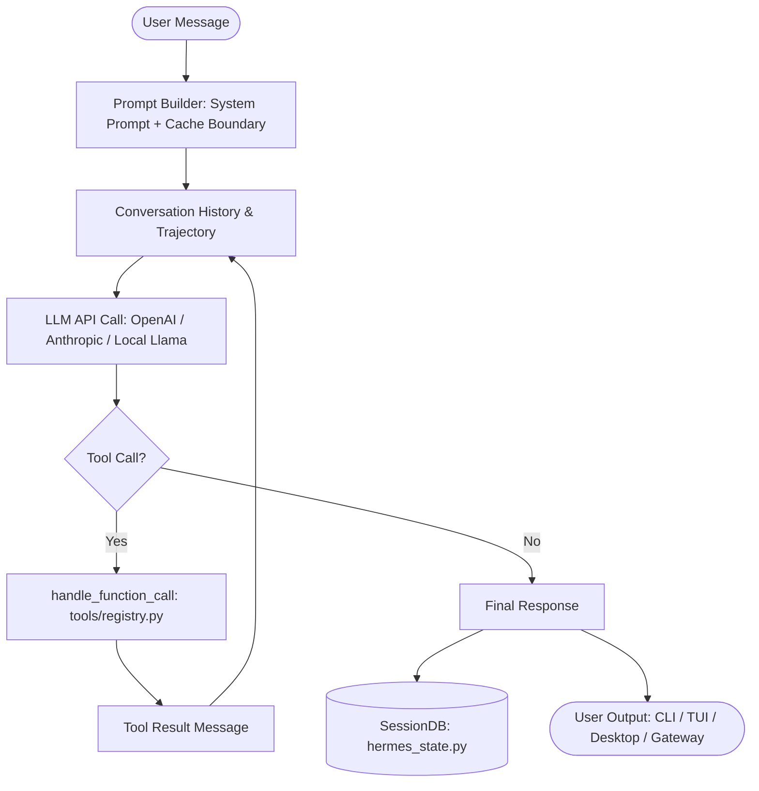

# Hermes Agent Repository Comprehensive Architecture & AI Navigation Map

> **Note for AI Models & Coding Assistants**: This document provides a complete, structured, and comprehensive map of the entire `hermes-agent` codebase. It serves as an authoritative guide alongside `AGENTS.md` and `GEMINI.md`.

---

## 1. Project Overview & Core Philosophy

**Hermes Agent** is a personal, multi-platform AI agent framework designed by Nous Research. It runs a single unified agent core across CLI, TUI, Electron Desktop App, and multi-channel messaging gateways (Telegram, Discord, Slack, LINE, WeCom, etc.).

### Sacred Architectural Invariants
1. **Per-conversation prompt caching is sacred**: Long-lived conversations reuse cached prompt prefixes. Context must never be mutated mid-conversation, toolsets must not be dynamically swapped mid-turn, and system prompts remain byte-stable.
2. **The core is a narrow waist; capability lives at the edges**: Model tools sent on every API call are minimized. New capabilities are implemented as CLI subcommands + skills, service-gated tools (`check_fn`), MCP servers, or plugins.
3. **Session-scoped capability**: UI/platform capabilities (e.g. desktop panes, reactions) belong to the *session*, never to global environment variables.

---

## 2. Directory Tree & Component Organization

```
hermes-agent/
├── AGENTS.md                  # Master development guide and contribution rubric
├── GEMINI.md                  # HardLink mirror of AGENTS.md for AI assistants
├── docs/maps/REPOSITORY_MAP.md # Comprehensive AI navigation and architectural map (this file)
├── pyproject.toml             # Python packaging, exact pinned dependencies, pytest/ruff config
├── package.json               # Monorepo workspaces definition (apps/*, ui-tui, web, tests-js)
├── pnpm-workspace.yaml        # PNPM workspace package config & overrides
│
├── run_agent.py               # AIAgent class — Core conversation loop (~12k LOC)
├── model_tools.py             # Tool orchestration, dynamic discovery, handle_function_call()
├── toolsets.py                # Toolset definitions & _HERMES_CORE_TOOLS registry
├── cli.py                     # HermesCLI class — Interactive terminal interface (~11k LOC)
├── hermes_state.py            # SessionDB — SQLite durable session store with FTS5 search
├── hermes_constants.py        # HERMES_HOME, profile-aware paths, cache directory resolvers
├── hermes_logging.py          # Multi-process safe logging (agent.log, errors.log, gateway.log)
├── batch_runner.py            # Multi-threaded parallel batch execution engine
│
├── agent/                     # Agent Core Subsystems
│   ├── conversation_loop.py   # Step-by-step turn execution, interrupts, and budgeting
│   ├── prompt_builder.py      # Byte-stable system prompt generation & cache boundaries
│   ├── memory_manager.py      # Short-term / long-term memory integration (Honcho, Mem0, etc.)
│   ├── context_compressor.py  # Lossless & summary-based context compression
│   ├── credential_pool.py     # Multi-key rotation & provider credential management
│   ├── display.py             # KawaiiSpinner & terminal activity feed formatting
│   ├── moa_loop.py            # Mixture-of-Agents multi-model routing
│   └── *_adapter.py           # Provider adapters (OpenAI, Anthropic, Gemini, Codex, Bedrock)
│
├── hermes_cli/                # CLI Subcommands & Tooling
│   ├── main.py                # CLI entry point (`hermes` command)
│   ├── setup_wizard.py        # Interactive first-time setup wizard
│   ├── skin_engine.py         # CLI theming & animated skin engine
│   └── plugins_manager.py     # CLI plugin installation, toggling, and registry
│
├── tools/                     # Tool Implementations (Auto-registered via tools/registry.py)
│   ├── registry.py            # Global tool registry, check_fn gates, schema validator
│   ├── file_tools.py          # read_file, write_file, patch_file, list_dir
│   ├── terminal_tool.py       # PTY-backed interactive shell execution
│   ├── web_tools.py           # Web search, scraping, URL safety, Exa/Firecrawl adapters
│   ├── browser_tool.py        # Playwright/CDP browser automation & Camofox anti-detection
│   ├── mcp_tool.py            # Model Context Protocol (MCP) client bridge & schema cache
│   ├── memory_tool.py         # Persistent knowledge recall, entity storage, vector memory
│   ├── tts_tool.py            # Voice synthesis (Edge TTS, Voicevox, ElevenLabs, Irodori)
│   ├── vision_tools.py        # Image resizing, inspection, OCR, and vision embedding
│   ├── environments/          # Execution environments (local, docker, ssh, modal, daytona)
│   └── vrchat_*_tool.py       # VRChat autonomy, OSC bridge, avatar & vision inspection tools
│
├── plugins/                   # Extensible Plugin Ecosystem (~60+ plugins)
│   ├── plugin_storage.py      # Isolated plugin data storage helper (<hermes_home>/plugin-data/<name>)
│   ├── registry.py            # Plugin tool and hook registration bus
│   ├── lmcache/               # KV cache optimization, provider context lengths, TTFT stats
│   ├── memory/                # Memory providers (honcho, mem0, supermemory, hindsight)
│   ├── model-providers/       # Custom inference backends (openrouter, anthropic, gmi, unsloth)
│   ├── kanban/                # Multi-agent task board & worker dispatcher
│   ├── aituber_onair/         # AI VTuber live broadcast, YouTube comment ingestion, OBS integration
│   ├── shinka-osint/          # OSINT intelligence gathering & evolutionary search
│   ├── voicevox_tts/          # Local Voicevox TTS engine integration
│   ├── irodori_tts/           # Irodori voice synthesis bridge
│   └── ...                    # Additional desktop, research, and autonomy plugins
│
├── gateway/                   # Multi-Platform Messaging Gateway
│   ├── run.py                 # Gateway server runner & daemon process
│   ├── session.py             # Chat session abstraction & message dispatcher
│   └── platforms/             # Platform Adapters:
│       ├── telegram.py        # Telegram Bot API & Webhook adapter
│       ├── discord.py         # Discord.py bot client & voice gateway
│       ├── slack.py           # Slack Bolt SDK socket & HTTP webhook handler
│       ├── line.py            # LINE Messaging API webhook & rich menu handler
│       ├── wecom.py           # WeChat Work (WeCom) callback & crypto handler
│       ├── weixin.py          # WeChat Official Account / Personal bot adapter
│       ├── yuanbao.py         # Tencent Yuanbao protocol adapter
│       ├── signal.py          # Signal CLI / REST bridge
│       └── ...                # WhatsApp, Matrix, Mattermost, BlueBubbles, SMS, Email
│
├── apps/desktop/              # Native Electron Desktop Application
│   ├── electron/              # Electron main process, IPC bridge, native window management
│   ├── src/                   # React 19 + Tailwind v4 + Vite renderer application
│   │   ├── store/             # Nanostores state management (chat, session, settings)
│   │   ├── components/        # UI components (ReviewPane, GitGraph, TerminalPane, ChatView)
│   │   └── plugins/           # Desktop renderer plugins
│   └── package.json           # Desktop package definition (`hermes@0.17.0`)
│
├── ui-tui/                    # Ink (React) Terminal UI (`hermes --tui`)
│   └── src/                   # Terminal UI state, layout, interactive chat
├── tui_gateway/               # Python JSON-RPC backend for the TUI
├── cron/                      # Background Scheduler (jobs.py, scheduler.py via croniter)
├── scripts/                   # Operations & Tooling Scripts
│   ├── windows/               # Windows Automation Suite:
│   │   ├── watchdog-go/       # Go-based mutual watchdog daemon (Desktop ↔ backend supervisor)
│   │   ├── start-llama-*.ps1  # Local LLM hotswap runners (Qwen3.5B / Qwen3.8B / HuiHui Gemma)
│   │   ├── Restart-*.ps1      # Full stack restart, recovery, autostart registration
│   │   └── *Tailscale*.ps1    # Tailscale Serve / Funnel integration scripts
│   └── check-windows-footguns.py # Windows compatibility and path safety linter
│
├── vendor/                    # Submodules and external engines
│   ├── openmanus/             # OpenManus agentic research engine
│   └── shinka-osint/          # Shinka Evolve OSINT search module
│
├── _docs/                     # Implementation logs & verification records
└── tests/                     # Comprehensive Pytest Suite (~17k+ tests)
    ├── test_lmcache_plugin.py # LMCache CRUD, context length, and tool tests
    ├── test_plugin_storage.py # Plugin directory isolation tests
    └── test_fast_safe_load.py # High-speed safe YAML loader tests
```

---

## 3. Core Subsystems & Data Flow

### 3.1 The AIAgent Conversation Loop (`run_agent.py`)


### 3.2 Tool System Architecture
- **Registration**: All tools invoke `registry.register(name, toolset, schema, handler, check_fn, requires_env)`.
- **Surface Gating**: Named toolsets (`desktop_ui`, `project`, `lmcache`, etc.) are resolved based on the session platform.
- **`check_fn`**: Determines runtime reachability (e.g. valid API key, local daemon alive) with TTL caching.

### 3.3 Plugin Storage Isolation
Plugins store durable state exclusively in `<hermes_home>/plugin-data/<plugin_name>/` via `plugins.plugin_storage`:
- `plugin_data_dir(plugin_name)`: Returns isolated directory.
- `plugin_db(plugin_name, filename)`: Returns managed SQLite connection with WAL mode enabled.

---

## 4. Local Execution & CI/CD Pipeline Standards

### 4.1 CI/CD Workflows (`.github/workflows/fork-cicd.yml`)
1. **Python Lint & Windows Footguns**:
   - `ruff check .` (enforces explicit encoding `PLW1514` & syntax).
   - `python scripts/check-windows-footguns.py --all` (scans for Windows path traps, `os.kill(0)`, and encoding flaws).
2. **TypeScript Typecheck**:
   - `pnpm --filter hermes typecheck` (validates Desktop renderer, Electron main, and e2e types).
3. **Go Modules Vet & Test**:
   - `cd scripts/windows/watchdog-go && GOOS=windows go vet ./...`
   - `cd tools/memory-graph-server && go vet ./...`
4. **Core Unit Verification**:
   - `python -m pytest tests/test_plugin_storage.py tests/test_fast_safe_load.py tests/test_lmcache_plugin.py -q`

### 4.2 Quality & Coding Conventions (MILSPEC Standards)
- **Python**: Managed via `uv`, executed with `py -3`. `logging` is mandatory (`print` is strictly forbidden).
- **TypeScript**: Strict types, no `any`, Nanostores for state, React 19 primitives.
- **Character Encoding**: Fixed to UTF-8 across all files.
- **Documentation**: Substantive changes must generate an implementation log under `_docs/yyyy-mm-dd_<feature>_<agent>.md`.
